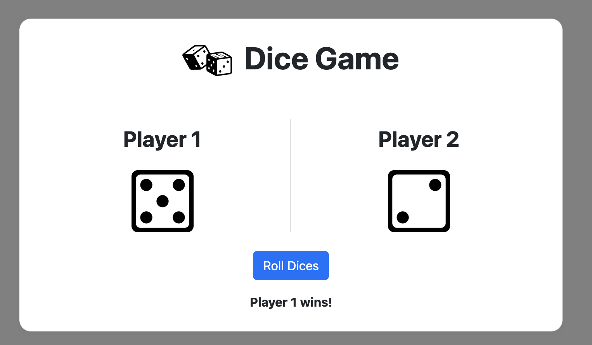
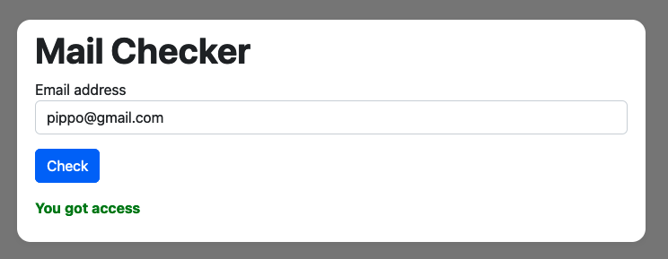

# js-mail-dadi
A simple program including a dice game and a mail checker
  

<h2>-- DICE GAME --</h2>
This game is <strong>built with JS.</strong>  

 

The game will generate two random numbers between 1 and 6, simulating two dices rolling.  
The dice with the higher number will be the winner. If the dices give the same number the result will be Draw.

 
<h2>-- EMAIL VERIFER  --</h2>
This is a email verifier <strong>built with JS</strong>, that will tell if the email written by the user is in the list of the guests of the party.  
<h2>Are you invited to Topolino party?</h2 >

 

Given a guests list, and given the user's email (that he will write in an input) the program will check if the user is invited to the party, or not. 
This program was created as an exercise to better understand <strong>for loop</strong> and <strong>arrays</strong>. The goal was to achieve a working program without using .include or While loops.

